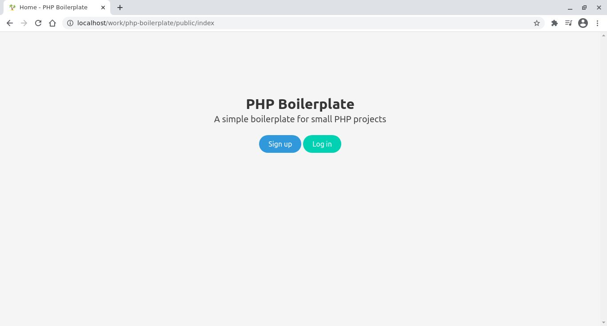

# PHP-boilerplate

A simple PHP project boilerplate for rapid development, with different functionalities:

- Authentication & middleware (user, admin)
- Database functions (dbSelect, dbQuery, dbInsertMany)
- Error & success message
- Image modal popup

## Installation

1. Create a database using MySQL
2. Add tables using `database.sql`
3. Edit `app/config.php`, to match your database settings
4. Register a user, then change his/her `role` to `admin`
